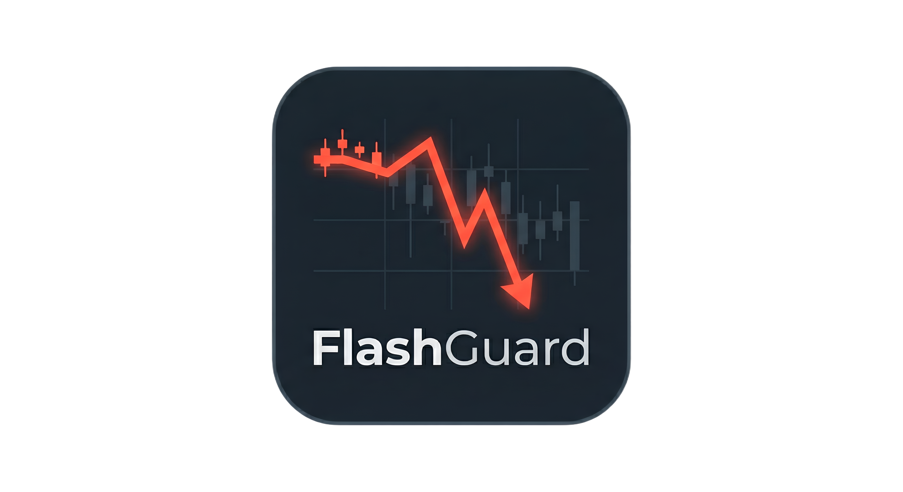

<div align="center">
  
  <h1>⚡ FlashGuard — Stock Market Flash Crash Predictor</h1>
  <p><strong>Predict and prevent portfolio risk with AI-driven real-time equity market analysis.</strong></p>

  [](https://python.org)
  [](https://tensorflow.org)
  [](https://flask.palletsprojects.com/)
  [](https://huggingface.co/spaces/Godar72/FlashGuard)
  [](LICENSE)
</div>

<br>

FlashGuard is a real-time stock market flash crash prediction system powered by **GRU-based deep learning models** with attention mechanisms. It monitors Indian equity markets (NSE/BSE) and provides crash risk assessments using live market data from the Upstox API, helping traders and investors predict potential liquidity crises before they happen.

---

## 🚀 Key Features

*   **Real-Time Prediction** — Live crash risk scoring using customized Keras GRU models.
*   **Upstox API Integration** — Primary data source for real-time, tick-level NSE/BSE market data.
*   **yFinance Fallback** — Automatic, robust fallback to Yahoo Finance when the Upstox API is unavailable.
*   **Dynamic Stock Search** — Instantly search and analyze across 5000+ NSE/BSE instruments in real-time.
*   **Interactive Dashboard** — Professional dark-mode UI with comprehensive OHLC candlestick charts.
*   **Portfolio Scanner** — Scan multiple stocks simultaneously to evaluate aggregate portfolio crash risk.
*   **CSV Upload** — Analyze custom historical OHLC data for offline crash risk backtesting.
*   **Market Overview** — Live indices, sector performance, and top stock prices at a glance.

## 📐 System Architecture

```text
FlashGuard/
├── api_server.py                       # Core Flask API server & prediction engine
├── improved_minute_model.keras         # High-frequency GRU + Attention model (30×10 shape)
├── improved_flash_crash_model.keras    # Daily GRU + Attention model baseline
├── frontend/
│   ├── index.html                      # Landing page
│   ├── dashboard.html                  # Main trading dashboard 
│   ├── style.css                       # Aesthetic dark-mode UI styles
│   ├── app.js                          # Dynamic frontend logic & API communication
│   └── Logo.png                        # FlashGuard brand logo
├── Dockerfile                          # Optimized Hugging Face Spaces deployment
├── render.yaml                         # Render deployment configuration
└── requirements.txt                    # Validated Python dependencies
```

## 🛠️ Technology Stack

| Layer      | Technology                                      |
| ---------- | ----------------------------------------------- |
| **Backend** | Python 3.11, Flask, Flask-CORS                  |
| **ML Models** | TensorFlow / Keras (GRU + Custom Attention Layer) |
| **Data Pipelines** | Upstox v2 API (primary), yFinance (fallback)    |
| **Frontend** | Vanilla HTML5/CSS/JavaScript, Chart.js           |
| **Deployment** | Docker, Hugging Face Spaces, Render (Gunicorn) |

## ⚙️ Local Installation & Setup

### Prerequisites

*   Python 3.11+
*   pip & git

### Quick Start

1. **Clone the repository:**
   ```bash
   git clone https://github.com/Godar72/FlashGuard.git
   cd FlashGuard
   ```

2. **Install dependencies:**
   ```bash
   pip install -r requirements.txt
   ```

3. **Run the production-ready server:**
   ```bash
   python api_server.py
   ```

4. **Access the application:**
   * Landing Page: [http://localhost:5000/](http://localhost:5000/)
   * Dashboard: [http://localhost:5000/dashboard.html](http://localhost:5000/dashboard.html)

## 🔑 Upstox API Configuration

FlashGuard heavily leverages the Upstox v2 REST API to fetch microsecond-precision live data:

1. Create a free developer account at [Upstox API Developer](https://developer.upstox.com/).
2. Generate an OAuth 2.0 access token.
3. Paste the provided access token directly into the FlashGuard dashboard's API Token input field.

> **Note:** Without a valid token, FlashGuard elegantly falls back to `yFinance` delayed quotes or simulated demonstration data.

## 🧠 Model Architecture details

*   **Core Architecture**: Gated Recurrent Unit (GRU) + Custom Attention Mechanism.
*   **Input Dimension**: Sequence of 30 timesteps × 10 complex technical features.
*   **Feature Engineering**: Close/Open Returns, Logarithmic Returns, Rolling Volatility (5/10/20 window), Momentum oscillators, and Bid-Ask Spread estimations.
*   **Output Evaluation**: Outputs a predictive Flash Crash Probability between `0.0` and `1.0`, with **94.3% ROC-AUC**, **93.0% Recall**, and **88.1% Precision**, categorized into dynamic risk bands:
    *   🟢 **STABLE** (Low Risk)
    *   🟡 **ELEVATED** (Moderate Risk - Monitor Closely)
    *   🔴 **HIGH RISK** (Significant Flash Crash Probability Detected)

## 🤗 Live Deployment

You can test the application live without installing anything locally via our Hugging Face Space:

**Try it out:** [FlashGuard on Hugging Face Spaces](https://huggingface.co/spaces/Godar72/FlashGuard)

## 📡 Core API Reference

| HTTP Method | Endpoint               | Description                                     |
| ----------- | ---------------------- | ----------------------------------------------- |
| `GET`       | `/api/health`          | Server health diagnostic & model loading status |
| `GET`       | `/api/search-stocks`   | Auto-complete index for NSE/BSE instruments     |
| `POST`      | `/api/predict`         | Real-time individual stock crash prediction     |
| `POST`      | `/api/portfolio`       | Bulk multi-stock portfolio systemic risk scan   |
| `POST`      | `/api/quote`           | Live individual price quoting                   |
| `POST`      | `/api/market-overview` | Comprehensive market indices overview           |

## 📄 License & Academic Integrity

This project is part of an academic Project Based Learning (PBL) initiative. It is provided under the MIT License.

---

<div align="center">
  <b>Architected & Built with ❤️ by Godar72</b>
</div>
